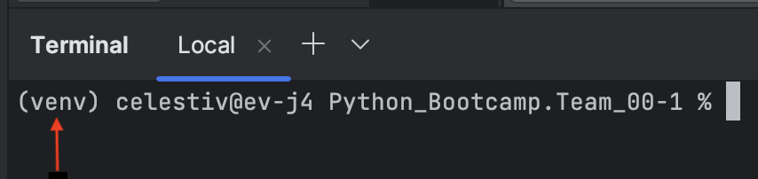

# Групповой проект Python bootcamp team00

## Участники: celestiv, jeffreyl

## Как запускать:

### Создать виртуальное окружение
#### Способ 1. venv

`python -m venv env`

После этого в папке env в текущей директории появится виртуальное окружение -
копия исполняемого файла python и необходимых файлов для его работы. 

После создания виртуального окружения его нужно активировать, обычно для этого нужно выполнить:
`../env/bin/activate`

#### Способ 2. pycharm

1. Скачать PyCharm Community edition(если его еще нет)

2. Открыть папку с проектом

3. В правом нижнем углу нажать на надпись Python(python 3.10 или подобное)
4. Выбрать "Add new interpreter -> Add local interpreter"
5. Переключатель должен оставаться на значении `New`
6. Указать папку, в которую сохранить новую копию питона
7. Выбрать версию python, с которой мы будем делать локальную копию
8. Нажать Ок
9. Запустить новый терминал в Pycharm, слева должно быть указание на папку с питоном

### Запускаем проект

#### ex 00. Парсим wikipedia
Можно просто запустить

`python cache_wiki.py`

Также можно указать параметры: глубину парсинга и начальную статью. По умолчанию глубина парсинга 3, статья

`python cache_wiki.py -d 3 -p Tatarstan`

#### ex 01. Находим кратчайший путь между двумя статьями

`python shortest_path.py --from <Первая ссылка> --to <Вторая ссылка>`

Аналогично можно использовать короткие флаги `-f`, `-t`

`python shortest_path.py -f <Первая ссылка> -t <Вторая ссылка>`
#### ex 02. Рисуем граф по полученным данным

`python render_graph.py`
